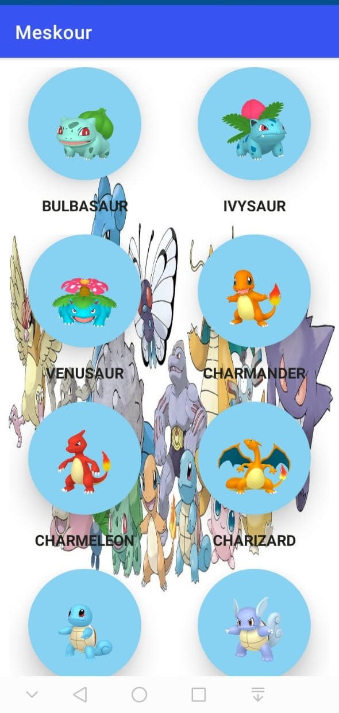
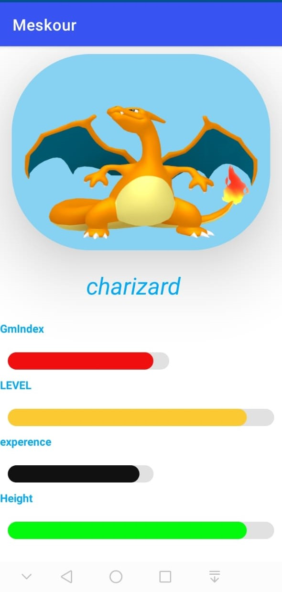

# Application  Android  (consomation des API Pkémon)
Il s'agit d'une application Android qui permet aux utilisateurs de parcourir une liste de Pokémon récupérés depuis Pokemon API
https://raw.githubusercontent.com/PokeAPI/sprites/master/sprites/pokemon/other/home

## How to used
Premièrement il faut installer Android Studio sur votre  machin\
1/ lancer Android Studio.\
2/ Cliquez sur "Ouvrir un projet Android Studio existant".\
3/ Accédez au dossier du projet importer.\
4/ Attendez que le projet soit généré ou bien les  installe les packages que j'ai utlisé.\
5/ Connectez votre appareil Android à votre machine (assurez-vous que le débogage USB est activé), ou bien instaler un  Emulateur  dans Android studio.\
6/ Cliquez sur le bouton "Exécuter" dans Android Studio et sélectionnez votre appareil connecté comme cible de déploiement.\
7/ Attendez que l'application s'installe et s'exécute sur votre appareil.\
     Au lancement de l'application, une liste de Pokémons s'affichera. L'utilisateur peut faire défiler la liste pour voir plus de Pokémons.\
Si l'utilisateur tape sur un Pokémon, un nouvel écran s'ouvrira affichant plus d'informations sur le Pokémon sélectionné.\

## Les Outile utiliser

-Android Studio - L'IDE utilisé pour créer l'application.\
-Retrofit - Client HTTP utilisé pour effectuer des requêtes API.\
-Gson - Utilisé pour analyser les données JSON.\
-PokeAPI - API utilisée pour récupérer les données Pokémon.\
-Glide - Framework de chargement d'images pour Android (load imag).
-Composants matériels - Activez un flux de travail de développement fiable pour créer des applications Android belles et fonctionnelles.\
-RecyclerView est le ViewGroup qui contient les vues correspondant à vos données.\
### Classe Pokemon.java
```java
package com.example.myapp.models;

public class Pokemon {
    private int number;
    private String name;
    private String url;
//Getters et Seters
    public String getName() {
        return name;
    }

    public void setName(String name) {
        this.name = name;
    }

    public String getUrl() {
        return url;
    }

    public void setUrl(String url) {
        this.url = url;
    }

    public int getNumber() {
        String[] urlPartes =url.split("/");
        return Integer.parseInt(urlPartes[urlPartes .length-1]);
    }

    public void setNumber(int number) {
        this.number = number;
    }
}
```
###Clase RetrofitConnection.java
```java 
package com.example.myapp.connection;

import com.example.myapp.models.PokemonInfo;
import com.example.myapp.models.PokemonRespuesta;
import com.example.myapp.pokeapi.PokeaService;

import java.util.Objects;

import retrofit2.Call;
import retrofit2.Retrofit;
import retrofit2.converter.gson.GsonConverterFactory;

public class RetrofitConnection {
    private static Retrofit retrofit;

    // Constructeur privé de la classe RetrofitConnection
    private RetrofitConnection(){
        // Crée un nouvel objet Retrofit en utilisant le Builder
        // avec l'URL de base de l'API, le convertisseur GsonConverterFactory
        // et l'enregistre dans la variable statique retrofit
        retrofit=new Retrofit.Builder()
                .baseUrl("https://pokeapi.co/api/v2/")
                .addConverterFactory(GsonConverterFactory.create())
                .build();
    }

    // Méthode privée pour obtenir l'objet Retrofit
    private static Retrofit getRetrofit(){
        // Vérifie si retrofit est null, et si oui, crée une nouvelle instance
        // de RetrofitConnection (en appelant le constructeur privé)
        // et enregistre cette instance dans la variable statique retrofit
        if(Objects.isNull(retrofit)) new RetrofitConnection();
        return retrofit;
    }

    // Méthode privée pour obtenir l'objet PokeaService
    private static PokeaService getPokeaService(){
        // Appelle la méthode getRetrofit() pour obtenir l'objet Retrofit,
        // puis utilise la méthode create() pour créer et retourner un objet PokeaService
        return getRetrofit().create(PokeaService.class);
    }

    // Méthode publique pour obtenir un objet Call<PokemonRespuesta> pour la liste des pokémons
    public static Call<PokemonRespuesta> getPokemonRespuestaCall(int limit, int offset){
        // Appelle la méthode getPokeaService() pour obtenir l'objet PokeaService,
        // puis appelle la méthode obtenerListaPokemon() de cet objet en passant les paramètres limit et offset,
        // et retourne l'objet Call<PokemonRespuesta> résultant
        return getPokeaService().obtenerListaPokemon(20,offset);
    }

    // Méthode publique pour obtenir un objet Call<PokemonInfo> pour les informations d'un pokémon
    public static Call<PokemonInfo> getPokemonInfoCall(int id){
        // Appelle la méthode getPokeaService() pour obtenir l'objet PokeaService,
        // puis appelle la méthode getPokemonInfoCall() de cet objet en passant le paramètre id,
        // et retourne l'objet Call<PokemonInfo> résultant
        return getPokeaService().getPokemonInfoCall(id);
    }

}
```

## Aplication interface

<div align="center"> 
   
     &nbsp;&nbsp;&nbsp;&nbsp;
    
</div> 


